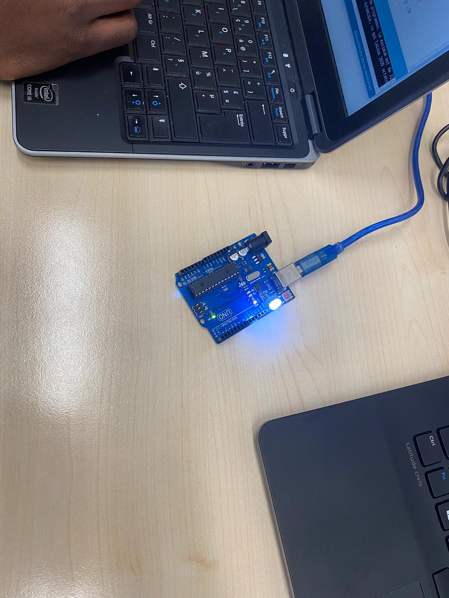

<h1>Lab1 Team : <b>Smart-Lock</b></h1>

  <h6>Commentaires Exercice_1</h6>
  

    Sur cet exercice, il nous a été demandé d'allumer le LED. 
    Pour cela, il nous a fallu :
    <ul>
      <li>Brancher Arduino à notre ordinateur à travers un cable usb reliant les 2</li>
      <li>Placer le LED sur le port 13 de Arduino</li>
      <li>Télécharger l'IDE Arduino</li>
      <li>Ecrire le programme permettant de faire un lien avec Arduino</li>
    </ul>
    En ce qui concerne, le choix du LED. Nous avions fait un premier choix du LED de couleur bleu. Mais avec ce LED, le téléversement n'avait aucun effet. Quand on a pris le LED blanc, le téléversement a eu comme effet l'allumage du LED (comme l'illustre l'image <i>Allumage</i>dans le dossier Pictures.
  

